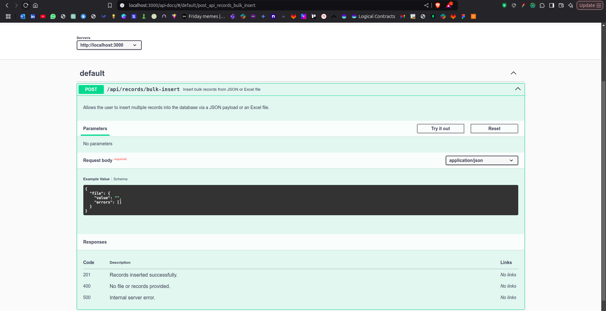
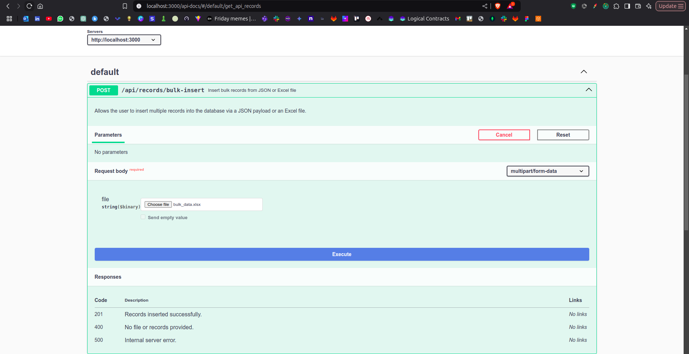
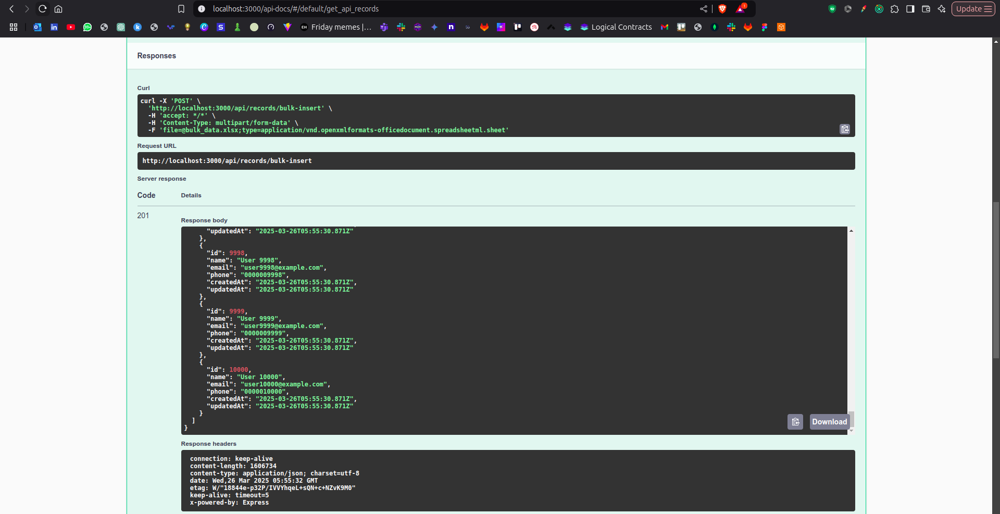

# Bulk Data Management API

This is a Node.js application for managing bulk data using PostgreSQL as the database and Sequelize as the ORM. The application provides endpoints for bulk data insertion and retrieval, supporting both JSON payloads and Excel file uploads.

## Features
- Bulk insert records from JSON payload or Excel file.
- Retrieve all records.
- PostgreSQL database with Sequelize ORM.
- Swagger documentation for API endpoints.
- Unit tests using Jest and Supertest.

## Tech Stack
- **Backend**: Node.js, Express.js
- **Database**: PostgreSQL
- **ORM**: Sequelize
- **Testing**: Jest, Supertest
- **Documentation**: Swagger (via `swagger-jsdoc` and `swagger-ui-express`)

## Setup Instructions

### Prerequisites
- Node.js (v14+)
- PostgreSQL
- npm or yarn

### Steps
1. Clone the repository:
   ```bash
   git clone https://github.com/your-repo/bulk-data-management.git
   cd bulk-data-management


### Screenshots



- A record of 10000 data is being added 


